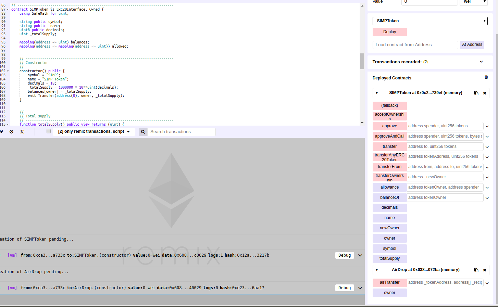

### 批量转账
ERC20-Token批量转账也是空投的一种,可以方便项目方,快速将需要空投的代币发送到用户地址.

### 优点  
如果当前我们要向成千上万的地址进行空投,使用批量转账可以带来很多的便利  
1.节约转币人工成本：你不会喜欢对这些地址进行一个接一个的调用接口进行转账的  
2.在gas费用消耗上,支付一次转币的费用会比几百次转账消耗的要少很多.


### ERC20代币转账
在ERC20中,有两种转账的方式：  
1.调用transfer()方法,直接向某一地址进行转账  
2.用户通过approve()方法,授权第三方(可以是合约)一部分token,之后可以配合transferFrom()方法实现向某地址进行转账.


### 合约
1. 代币合约
2. 空投合约

### 空投合约代码
1.通过transfer接口进行转账  
测试过程：  
1.部署simptoken.sol代币合约,合约地址(0xef55bfac4228981e850936aaf042951f7b146e41)  
2.部署airDrop.sol空投合约,合约地址(0xdc04977a2078c8ffdf086d618d1f961b6c546222)  
3.因为该合约调用的是transfer()接口转账,那么airDropTransfer合约地址必须要有一定量的token才行.  

所以调用simptoken合约中的transfer()接口向airDropTransfer合约地址转入一定量或者全部的token
```$xslt
transfer: 
    to: 0xdc04977a2078c8ffdf086d618d1f961b6c546222
tokens: 1000000000000000000000
```
4.调用空投合约的airTransfer()接口,向多个地址进行转账
```$xslt
airTransfer:
 _tokenAddress: 0xef55bfac4228981e850936aaf042951f7b146e41(simptoken的合约地址)
   _recipients: ["0x14723a09acff6d2a60dcdf7aa4aff308fddc160c","0x4b0897b0513fdc7c541b6d9d7e929c4e5364d2db","0x583031d1113ad414f02576bd6afabfb302140225","0xdd870fa1b7c4700f2bd7f44238821c26f7392148","0x9f1d94d4d50c3237d5c12a8753163696f0febb66"]
       _values: 100
```

5.调用simptoken合约中的balanceOf()查看空投的地址上token的数量,确认转账是否成功
```$xslt
balanceOf: 0x14723a09acff6d2a60dcdf7aa4aff308fddc160c
//0: uint256: balance 100
balanceOf: 0x4b0897b0513fdc7c541b6d9d7e929c4e5364d2db
//0: uint256: balance 100
balanceOf: 0x583031d1113ad414f02576bd6afabfb302140225
//0: uint256: balance 100
balanceOf: 0xdd870fa1b7c4700f2bd7f44238821c26f7392148
//0: uint256: balance 100
balanceOf: 0x9f1d94d4d50c3237d5c12a8753163696f0febb66
//0: uint256: balance 100
```
6.如果空投结束,airDropTransfer合约还有一定的token剩余,可以调用withdrawalToken将余额提取到token合约
```$xslt
withdrawalToken: 0xef55bfac4228981e850936aaf042951f7b146e41(simptoken的合约地址)
```
//airDropTransfer.sol
```$xslt
contract Ownable {
  address public owner;
 
  constructor() public {
    owner = msg.sender;
  }

  modifier onlyOwner() {
    require(msg.sender == owner);
    _;
  }
}

interface SIMPToken {
  function balanceOf(address tokenOwner) public view returns (uint balance);
  function transfer(address to, uint tokens) public returns (bool success);
}

contract airDropTransfer is Ownable {
    
    function airTransfer(address _tokenAddress,address[] _recipients, uint _values) onlyOwner public returns (bool) {
        require(_recipients.length > 0);

        SIMPToken token = SIMPToken(_tokenAddress);
        
        for(uint j = 0; j < _recipients.length; j++){
            token.transfer(_recipients[j], _values);
        }
 
        return true;
    }
 
     function withdrawalToken(address _tokenAddress) onlyOwner public { 
        SIMPToken token = SIMPToken(_tokenAddress);
        token.transfer(owner, token.balanceOf(this));
    }
}

```
2.通过transferFrom()接口进行转账  
测试过程：  
1.部署simptoken.sol代币合约,合约地址(0x0c2e77121daf0270d26bf0a7e9ab0faa8bf739ef)  
2.部署airDropTransferFrom.sol空投合约,合约地址(0x038f160ad632409bfb18582241d9fd88c1a072ba)  
3.因为该合约调用的是transferFrom()接口转账,那么airDropTransferFrom合约地址拥有simptoken拥有者一定量token的授权才行.  

所以调用simptoken合约中的approve()接口向airDrop合约地址授权一定量的token
```$xslt
approve: 
    to: 0x038f160ad632409bfb18582241d9fd88c1a072ba(simptoken的合约地址)
tokens: 1000000000000000000000
```
4.调用空投合约的airTransfer()接口,向多个地址进行转账,可以看到改接口的_values是个数组,所以可以对不同地址空投不同数量的token
```$xslt
airTransfer:
 _tokenAddress: 0x038f160ad632409bfb18582241d9fd88c1a072ba(simptoken的合约地址)
   _recipients: ["0x14723a09acff6d2a60dcdf7aa4aff308fddc160c","0x4b0897b0513fdc7c541b6d9d7e929c4e5364d2db","0x583031d1113ad414f02576bd6afabfb302140225","0xdd870fa1b7c4700f2bd7f44238821c26f7392148","0x9f1d94d4d50c3237d5c12a8753163696f0febb66"]
       _values: [100,200,300,400,500]
```

5.调用simptoken合约中的balanceOf()查看空投的地址上token的数量,确认转账是否成功
```$xslt
balanceOf: 0x14723a09acff6d2a60dcdf7aa4aff308fddc160c
//0: uint256: balance 100
balanceOf: 0x4b0897b0513fdc7c541b6d9d7e929c4e5364d2db
//0: uint256: balance 200
balanceOf: 0x583031d1113ad414f02576bd6afabfb302140225
//0: uint256: balance 300
balanceOf: 0xdd870fa1b7c4700f2bd7f44238821c26f7392148
//0: uint256: balance 400
balanceOf: 0x9f1d94d4d50c3237d5c12a8753163696f0febb66
//0: uint256: balance 500
```
6.如果空投结束,airDropTransferFrom合约还有一定授权的token剩余,可以调用simptoken合约的approve()接口,将授权数量设置为0即可
```$xslt
approve: 
    to: 0x038f160ad632409bfb18582241d9fd88c1a072ba(simptoken的合约地址)
tokens: 0
```

//airDropTransferFrom.sol
```$xslt
contract Ownable {
  address public owner;
 
  constructor() public {
    owner = msg.sender;
  }

  modifier onlyOwner() {
    require(msg.sender == owner);
    _;
  }
}

interface SIMPToken {
  function transferFrom(address from, address to, uint tokens) public returns (bool success);
}

contract airDropTransferFrom is Ownable {
    
    function airTransfer(address _tokenAddress,address[] _recipients,uint256[] _values) onlyOwner public returns(bool) {
       SIMPToken token = SIMPToken(_tokenAddress);
       for(uint256 i=0;i<_recipients.length;i++){
           token.transferFrom(msg.sender,_recipients[i],_values[i]);
       }
       return true;
    }
}
```

### remix操作界面
 

### 代币合约代码
simptoken.sol
```$xslt

pragma solidity ^0.4.24;

// ----------------------------------------------------------------------------
// Safe maths
// ----------------------------------------------------------------------------
library SafeMath {
    function add(uint a, uint b) internal pure returns (uint c) {
        c = a + b;
        require(c >= a);
    }
    function sub(uint a, uint b) internal pure returns (uint c) {
        require(b <= a);
        c = a - b;
    }
    function mul(uint a, uint b) internal pure returns (uint c) {
        c = a * b;
        require(a == 0 || c / a == b);
    }
    function div(uint a, uint b) internal pure returns (uint c) {
        require(b > 0);
        c = a / b;
    }
}


// ----------------------------------------------------------------------------
// ERC Token Standard #20 Interface
// https://github.com/ethereum/EIPs/blob/master/EIPS/eip-20.md
// ----------------------------------------------------------------------------
contract ERC20Interface {
    function totalSupply() public constant returns (uint);
    function balanceOf(address tokenOwner) public constant returns (uint balance);
    function allowance(address tokenOwner, address spender) public constant returns (uint remaining);
    function transfer(address to, uint tokens) public returns (bool success);
    function approve(address spender, uint tokens) public returns (bool success);
    function transferFrom(address from, address to, uint tokens) public returns (bool success);

    event Transfer(address indexed from, address indexed to, uint tokens);
    event Approval(address indexed tokenOwner, address indexed spender, uint tokens);
}


// ----------------------------------------------------------------------------
// Contract function to receive approval and execute function in one call
//
// Borrowed from MiniMeToken
// ----------------------------------------------------------------------------
contract ApproveAndCallFallBack {
    function receiveApproval(address from, uint256 tokens, address token, bytes data) public;
}


// ----------------------------------------------------------------------------
// Owned contract
// ----------------------------------------------------------------------------
contract Owned {
    address public owner;
    address public newOwner;

    event OwnershipTransferred(address indexed _from, address indexed _to);

    constructor() public {
        owner = msg.sender;
    }

    modifier onlyOwner {
        require(msg.sender == owner);
        _;
    }

    function transferOwnership(address _newOwner) public onlyOwner {
        newOwner = _newOwner;
    }
    function acceptOwnership() public {
        require(msg.sender == newOwner);
        emit OwnershipTransferred(owner, newOwner);
        owner = newOwner;
        newOwner = address(0);
    }
}


// ----------------------------------------------------------------------------
// ERC20 Token, with the addition of symbol, name and decimals and a
// simp supply
// ----------------------------------------------------------------------------
contract SIMPToken is ERC20Interface, Owned {
    using SafeMath for uint;

    string public symbol;
    string public  name;
    uint8 public decimals;
    uint _totalSupply;

    mapping(address => uint) balances;
    mapping(address => mapping(address => uint)) allowed;


    // ------------------------------------------------------------------------
    // Constructor
    // ------------------------------------------------------------------------
    constructor() public {
        symbol = "SIMP";
        name = "SIMP Token";
        decimals = 18;
        _totalSupply = 1000000 * 10**uint(decimals);
        balances[owner] = _totalSupply;
        emit Transfer(address(0), owner, _totalSupply);
    }


    // ------------------------------------------------------------------------
    // Total supply
    // ------------------------------------------------------------------------
    function totalSupply() public view returns (uint) {
        return _totalSupply.sub(balances[address(0)]);
    }


    // ------------------------------------------------------------------------
    // Get the token balance for account `tokenOwner`
    // ------------------------------------------------------------------------
    function balanceOf(address tokenOwner) public view returns (uint balance) {
        return balances[tokenOwner];
    }


    // ------------------------------------------------------------------------
    // Transfer the balance from token owner's account to `to` account
    // - Owner's account must have sufficient balance to transfer
    // - 0 value transfers are allowed
    // ------------------------------------------------------------------------
    function transfer(address to, uint tokens) public returns (bool success) {
        balances[msg.sender] = balances[msg.sender].sub(tokens);
        balances[to] = balances[to].add(tokens);
        emit Transfer(msg.sender, to, tokens);
        return true;
    }


    // ------------------------------------------------------------------------
    // Token owner can approve for `spender` to transferFrom(...) `tokens`
    // from the token owner's account
    //
    // https://github.com/ethereum/EIPs/blob/master/EIPS/eip-20-token-standard.md
    // recommends that there are no checks for the approval double-spend attack
    // as this should be implemented in user interfaces 
    // ------------------------------------------------------------------------
    function approve(address spender, uint tokens) public returns (bool success) {
        allowed[msg.sender][spender] = tokens;
        emit Approval(msg.sender, spender, tokens);
        return true;
    }


    // ------------------------------------------------------------------------
    // Transfer `tokens` from the `from` account to the `to` account
    // 
    // The calling account must already have sufficient tokens approve(...)-d
    // for spending from the `from` account and
    // - From account must have sufficient balance to transfer
    // - Spender must have sufficient allowance to transfer
    // - 0 value transfers are allowed
    // ------------------------------------------------------------------------
    function transferFrom(address from, address to, uint tokens) public returns (bool success) {
        balances[from] = balances[from].sub(tokens);
        allowed[from][msg.sender] = allowed[from][msg.sender].sub(tokens);
        balances[to] = balances[to].add(tokens);
        emit Transfer(from, to, tokens);
        return true;
    }


    // ------------------------------------------------------------------------
    // Returns the amount of tokens approved by the owner that can be
    // transferred to the spender's account
    // ------------------------------------------------------------------------
    function allowance(address tokenOwner, address spender) public view returns (uint remaining) {
        return allowed[tokenOwner][spender];
    }


    // ------------------------------------------------------------------------
    // Token owner can approve for `spender` to transferFrom(...) `tokens`
    // from the token owner's account. The `spender` contract function
    // `receiveApproval(...)` is then executed
    // ------------------------------------------------------------------------
    function approveAndCall(address spender, uint tokens, bytes data) public returns (bool success) {
        allowed[msg.sender][spender] = tokens;
        emit Approval(msg.sender, spender, tokens);
        ApproveAndCallFallBack(spender).receiveApproval(msg.sender, tokens, this, data);
        return true;
    }


    // ------------------------------------------------------------------------
    // Don't accept ETH
    // ------------------------------------------------------------------------
    function () public payable {
        revert();
    }


    // ------------------------------------------------------------------------
    // Owner can transfer out any accidentally sent ERC20 tokens
    // ------------------------------------------------------------------------
    function transferAnyERC20Token(address tokenAddress, uint tokens) public onlyOwner returns (bool success) {
        return ERC20Interface(tokenAddress).transfer(owner, tokens);
    }
}
```