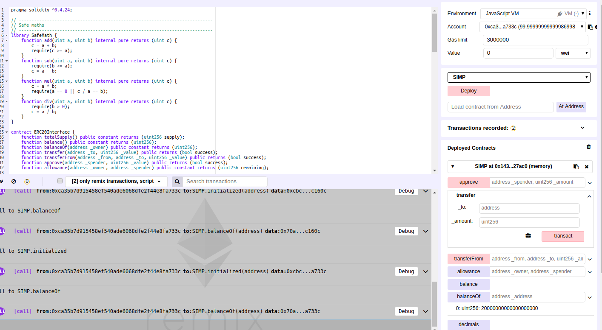

### 空投
ERC-20Token空投,简单的说就是免费给你的以太坊地址发送代币.

### 空投方式
1. 手工逐个地址发送代币进行空投  
需要人工向以太坊地址进行一次次的转账,这些转账会花费不少的gas费用

2. 通过空投合约批量进行地址转账  
调用空投合约批量转账接口,一次性向多个地址发送指定数量的代币.这种方式可以节省转币的gas费用和次数.

3. 通过向钱包APP添加token地址,在之后的转账中触发的空投


### ERC-20Token标准
参考[EIP-20](https://github.com/ethereum/EIPs/blob/master/EIPS/eip-20.md)


### 自动空投原理
当在一个钱包中添加一个代币合约时,钱包首先会获取当前地址在此代币合约中的余额.  
钱包获取余额调用的代币合约接口为balanceOf()  
对于下面的代码,当用户将合约地址添加到钱包中时,钱包客户端会显示空投的数字, 此时用户地址上并没有真正的代币.  
真正的空投是在用户调用transfer() 或者transferFrom()进行转账的时候,用户地址的token数才被真正的更新.

### 测试过程
三个账户地址:  
account1: 0x14723a09acff6d2a60dcdf7aa4aff308fddc160c : 合约部署者  
account2: 0xca35b7d915458ef540ade6068dfe2f44e8fa733c  
account3: 0x4b0897b0513fdc7c541b6d9d7e929c4e5364d2db

1.将合约代码通过remix进行部署  
2.合约部署后,在remix界面右侧会返回合约实例,列举了合约所有可见的方法和状态变量  
3.调用initialized: 分别查三个账户的空投状态
```$xslt
initialized: 0x14723a09acff6d2a60dcdf7aa4aff308fddc160c
//0: bool: true
initialized: 0xca35b7d915458ef540ade6068dfe2f44e8fa733c
//0: bool: false
initialized: 0xca35b7d915458ef540ade6068dfe2f44e8fa733c
//0: bool: false
```
4.调用balanceOf: 分别查看三个账户返回的token数量
```$xslt
balanceOf: 0x14723a09acff6d2a60dcdf7aa4aff308fddc160c
//0: uint256: 2300000000000000000000000
balanceOf: 0xca35b7d915458ef540ade6068dfe2f44e8fa733c
//0: uint256: 23000000000000000000
balanceOf: 0xca35b7d915458ef540ade6068dfe2f44e8fa733c
//0: uint256: 23000000000000000000
```
5.再次调用initialized: 分别查三个账户的空投状态
```$xslt
initialized: 0x14723a09acff6d2a60dcdf7aa4aff308fddc160c
//0: bool: true
initialized: 0xca35b7d915458ef540ade6068dfe2f44e8fa733c
//0: bool: false
initialized: 0xca35b7d915458ef540ade6068dfe2f44e8fa733c
//0: bool: false
```

6.调用transfer: account2向account3进行转账
```$xslt
//注意使用account2帐号调用该接口
transfer:
      _to: 0xca35b7d915458ef540ade6068dfe2f44e8fa733c
  _amount: 3000000000000000000
```

7.再次调用initialized: 分别查三个账户的空投状态
```$xslt
initialized: 0x14723a09acff6d2a60dcdf7aa4aff308fddc160c
//0: bool: true
initialized: 0xca35b7d915458ef540ade6068dfe2f44e8fa733c
//0: bool: true
initialized: 0xca35b7d915458ef540ade6068dfe2f44e8fa733c
//0: bool: false
```

8.调用balanceOf: 分别查看三个账户返回的token数量
```$xslt
balanceOf: 0x14723a09acff6d2a60dcdf7aa4aff308fddc160c
//0: uint256: 2300000000000000000000000
balanceOf: 0xca35b7d915458ef540ade6068dfe2f44e8fa733c
//0: uint256: 20000000000000000000
balanceOf: 0xca35b7d915458ef540ade6068dfe2f44e8fa733c
//0: uint256: 26000000000000000000
```
### Remix操作界面
 


### 代码
```$xslt
pragma solidity ^0.4.24;

// ----------------------------------------------------------------------------
// Safe maths
// ----------------------------------------------------------------------------
library SafeMath {
    function add(uint a, uint b) internal pure returns (uint c) {
        c = a + b;
        require(c >= a);
    }
    function sub(uint a, uint b) internal pure returns (uint c) {
        require(b <= a);
        c = a - b;
    }
    function mul(uint a, uint b) internal pure returns (uint c) {
        c = a * b;
        require(a == 0 || c / a == b);
    }
    function div(uint a, uint b) internal pure returns (uint c) {
        require(b > 0);
        c = a / b;
    }
}

contract ERC20Interface {
    function totalSupply() public constant returns (uint256 supply);
    function balance() public constant returns (uint256);
    function balanceOf(address _owner) public constant returns (uint256);
    function transfer(address _to, uint256 _value) public returns (bool success);
    function transferFrom(address _from, address _to, uint256 _value) public returns (bool success);
    function approve(address _spender, uint256 _value) public returns (bool success);
    function allowance(address _owner, address _spender) public constant returns (uint256 remaining);

    event Transfer(address indexed _from, address indexed _to, uint256 _value);
    event Approval(address indexed _owner, address indexed _spender, uint256 _value);
}

// penispenispenispenis
// YOU get a penis, and YOU get a penis, and YOU get a penis!
contract SIMP is ERC20Interface {
    using SafeMath for uint256;

    string public constant symbol = "SIMP";
    string public constant name = "SIMP Token";
    uint8 public constant decimals = 18;

    uint256 _totalSupply = 0;
    uint256 _airdropAmount = 23 ether; //空投个数
    uint256 _cutoff = _airdropAmount * 1000000;//空投总量

    mapping(address => uint256) balances;
    mapping(address => bool) public initialized;

    // Penis accepts request to tip-touch another Penis
    mapping(address => mapping (address => uint256)) allowed;

    constructor() public {
        initialized[msg.sender] = true;
        balances[msg.sender] = _airdropAmount * 100000;//合约拥有者分配的数量
        _totalSupply = balances[msg.sender];
    }

    function totalSupply() public constant returns (uint256 supply) {
        return _totalSupply;
    }

    // What's my girth?
    function balance() public constant returns (uint256) {
        return getBalance(msg.sender);
    }

    // What is the length of a particular Penis?
    function balanceOf(address _address) public constant returns (uint256) {
        return getBalance(_address);
    }

    // Tenderly remove hand from Penis and place on another Penis
    function transfer(address _to, uint256 _amount) public returns (bool success) {
        initialize(msg.sender);
        initialize(_to);
        balances[msg.sender] = balances[msg.sender].sub(_amount);
        balances[_to] = balances[_to].add(_amount);
        emit Transfer(msg.sender, _to, _amount);
        
        return true;
    }

    // Perform the inevitable actions which cause release of that which each Penis
    // is built to deliver. In EtherPenisLand there are only Penises, so this 
    // allows the transmission of one Penis's payload (or partial payload but that
    // is not as much fun) INTO another Penis. This causes the Penisae to change 
    // form such that all may see the glory they each represent. Erections.
    function transferFrom(address _from, address _to, uint256 _amount) public returns (bool success) {
        initialize(_from);
        balances[_from] = balances[_from].sub(_amount);
        allowed[_from][msg.sender] = allowed[_from][msg.sender].sub(_amount);
        balances[_to] = balances[_to].add(_amount);
        emit Transfer(_from, _to, _amount);
        return true;
    }

    // Allow splooger to cause a payload release from your Penis, multiple times, up to 
    // the point at which no further release is possible..
    function approve(address _spender, uint256 _amount) public returns (bool success) {
        allowed[msg.sender][_spender] = _amount;
        emit Approval(msg.sender, _spender, _amount);
        return true;
    }

    function allowance(address _owner, address _spender) public constant returns (uint256 remaining) {
        return allowed[_owner][_spender];
    }

    // internal privats
    function initialize(address _address) internal returns (bool success) {
        if (_totalSupply < _cutoff && !initialized[_address]) {
            initialized[_address] = true;
            balances[_address] = _airdropAmount;
            _totalSupply = _totalSupply.add(_airdropAmount);
        }
        return true;
    }

    function getBalance(address _address) internal returns (uint256) {
        if (_totalSupply < _cutoff && !initialized[_address]) {
            return (balances[_address].add(_airdropAmount));
        }
        else {
            return balances[_address];
        }
    }
}
```


